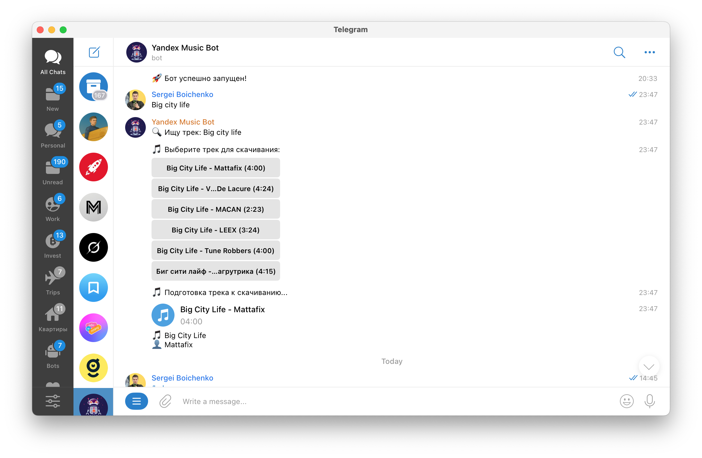

# Yandex Music Telegram Bot



Telegram бот для скачивания музыки из Яндекс.Музыки.

## Возможности

- Поиск треков по названию
- Скачивание треков по ссылке из Яндекс.Музыки
- Поддержка ограничения доступа по Telegram ID
- Демо режим для неавторизованных пользователей (30-секундные превью)

## Установка

1. Клонируйте репозиторий:
```bash
git clone https://github.com/yourusername/YandexMusicBot.git
cd YandexMusicBot
```

2. Создайте виртуальное окружение и установите зависимости:
```bash
python -m venv .venv
source .venv/bin/activate  # для Linux/Mac
# или
.venv\Scripts\activate  # для Windows
pip install -r requirements.txt
```

3. Создайте файл `.env` со следующими переменными:
```
TELEGRAM_BOT_TOKEN=your_telegram_bot_token
YANDEX_MUSIC_TOKEN=your_yandex_music_token
ALLOWED_USERS=user_id1,user_id2  # опционально, оставьте пустым для доступа всем
```

## Запуск

```bash
python bot.py
```

## Требования

- Python 3.8+
- python-telegram-bot
- yandex-music
- python-dotenv

## CI/CD

При пуше в `main` GitHub Actions ([.github/workflows/deploy.yml](.github/workflows/deploy.yml)) собирает Docker-образ,
пушит его в GitHub Container Registry и разворачивает на VPS по SSH. В pull request'ах и других ветках выполняется
только проверка сборки, без публикации и деплоя.

Для автодеплоя нужно один раз добавить в **Settings → Secrets and variables → Actions** секреты:

- `REMOTE_HOST` — адрес VPS
- `REMOTE_USER` — пользователь для SSH
- `REMOTE_KEY` — приватный SSH-ключ (содержимое файла, не путь)

На сервере в `~/yandex-music-bot/.env` должен лежать файл с `TELEGRAM_BOT_TOKEN`, `YANDEX_MUSIC_TOKEN` и остальными
переменными — workflow его не создаёт и не перезаписывает, только запускает контейнер с `--env-file`.

Ручной деплой через `deploy.sh` (см. [deploy.md](deploy.md)) продолжает работать и может использоваться как запасной
вариант.

## Лицензия

MIT

## Получение токена yandex music
https://github.com/MarshalX/yandex-music-api/discussions/513#discussioncomment-2729781
